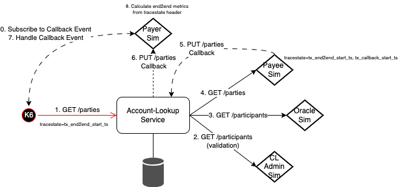
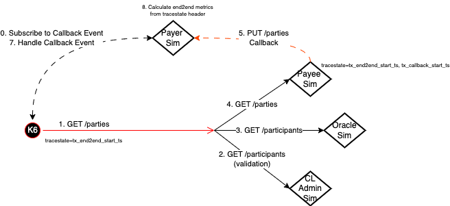

# Performance Characterization

## Test Cases

Test Case | Description | Notes
---------|----------|---------
 1 | FSPIOP GetParties End-to-end | FSPIOP GET /parties request executed from K6 via the Account-Lookup-Service

## Test Scenarios

Scenario | Description | Test-Case | Repeatable (Y/N) | Notes
---------|----------|---------|---------|---------
 1 | ALS-bypass Baseline with Sims-only | 1 | Y | .
 2 | ALS Baseline with Sims-only | 1 | Y | .
 3 | ~~ALS Baseline with Sims-only, Scale 2~~ | 1 | Y | N/A due to 10 op/s rate limit.
 4 | ~~ALS Baseline with Sims-only, Scale 4~~ | 1 | Y | N/A due to 10 op/s rate limit.
 5 | ALS Baseline with Sims-only, no logs/audit-events | 1 | Y | .
 6 | ALS Baseline with Sims-only, HTTP-Keep-Alive enabled | 1 | N | .
 7 | ALS Baseline with Sims-only, UV_THREADS | 1 | N | .
 8 | ALS Baseline with Sims-only, multiple k6 VUs | 1 | N | .
 9 | ALS Baseline with Sims-only, MySQL in-memory DB | 1 | N | .
 10 | ALS Baseline with Sims-only, Disabled JSON.stringify [ALS v14.2.3](https://github.com/mojaloop/account-lookup-service/releases/tag/v14.2.3) | 1 | N | [account-lookup-service/pull/460](https://github.com/mojaloop/account-lookup-service/pull/460), [v14.2.3](https://github.com/mojaloop/account-lookup-service/releases/tag/v14.2.3)
 11 | ALS Baseline with Sims-only, Disabled JSON.stringify [ALS v14.2.3](https://github.com/mojaloop/account-lookup-service/releases/tag/v14.2.3) + 4x k6 VUs | 1 | N | .
 12 | ALS Baseline with Sims-only, Disabled JSON.stringify [ALS v14.2.3](https://github.com/mojaloop/account-lookup-service/releases/tag/v14.2.3) + Scale 2 | 1 | N | .
 13 | ALS Baseline with Sims-only, Disabled JSON.stringify [ALS v14.2.3](https://github.com/mojaloop/account-lookup-service/releases/tag/v14.2.3) + Scale 4 + 4x k6 VUs | 1 | N | .
 14 | ALS Baseline with Sims-only, Disabled JSON.stringify [ALS v14.2.3](https://github.com/mojaloop/account-lookup-service/releases/tag/v14.2.3) + Scale 4 + 6x k6 VUs | 1 | N | .
 15 | ALS Baseline with Sims-only, Disabled JSON.stringify [ALS v14.2.3](https://github.com/mojaloop/account-lookup-service/releases/tag/v14.2.3) + Scale 4 + 6x k6 VUs + Enhanced Caching for ValidateParticipants | 1 | N | [account-lookup-service/pull/461](https://github.com/mojaloop/account-lookup-service/pull/461), [v14.2.4-snapshot.3](https://github.com/mojaloop/account-lookup-service/releases/tag/v14.2.4-snapshot.3)
 16 | ALS Baseline with Sims-only, Disabled JSON.stringify [ALS v14.2.3](https://github.com/mojaloop/account-lookup-service/releases/tag/v14.2.3) + Scale 4 + 6x k6 VUs + Enhanced Caching for ValidateParticipants + OracleRequest | 1 | N | [account-lookup-service/pull/461](https://github.com/mojaloop/account-lookup-service/pull/461), [v14.3.4-snapshot.0](https://github.com/mojaloop/account-lookup-service/releases/tag/v14.3.0-snapshot.0)

### Approach

The approach taken for characterization is follows:

#### 0. Tools Used

| Tool | Description |
|---|---|
| **ml-core-test-harness** | The [ml-core-test-harness](https://github.com/mojaloop/ml-core-test-harness) is a light-weight Docker-composed based test harness used by the Mojaloop community to execute Functional, and now Performance-Characterization tests |
| **K6** | [Grafana k6](https://k6.io/docs/) is an open-source load testing tool. |
| **Docker Compose**  | [Docker Compose](https://docs.docker.com/compose/) is a tool for defining and running multi-container Docker applications. |

#### 1. Setup Tests, Test-Scenarios & ml-core-test-harness

Initially setup the ml-core-test-harness to support the [Test Scenarios](#test-scenarios) described above. This is done by setting removing all externalized dependencies by simulating them with a simulator (also known as the "Callback Handler Service").

Refer to the following diagram showing the Account-Lookup-Service characterization interaction diagram:

In the above, the "Callback Handler Service" has been used to simulate the following Account-Lookup-Service's dependencies:

- **Oracle** - A Participant (i.e. DFSP) registry that resolves the Participant based on a given Party Identifier (e.g. MSISDN).
- **Payer FSP** - The Payer FSP Participant that will be used to receive the final FSPIOP PUT /parties Callback.
- **Payee FSP** - The Payee FSP Participant that will be used to receive the FSPIOP GET /parties Request, and to generate the FSPIOP PUT /parties Callback response.
- **Central-Ledger Admin Service** - The Central-Ledger Admin Service that provides a GET /participants end-point to validate Participants, and the GET/participants/{participantId}/endpoints to provide the necessary routing information to forward requests for the FSPIOP GET/PUT /parties Request/Callback.

In this stage we would also identify:

1. any metrics that are required to correctly measure and monitoring out tests.
2. any dashboards that are required to visualize that information.

#### 2. Capturing End-to-end Metrics

We have two approaches to capture the End-to-end metrics of a transaction.

##### 2.1 Tracestate Headers

The [Tracestate](https://github.com/mojaloop/mojaloop-specification/blob/master/fspiop-api/documents/Tracing%20v1.0.md#table-4--data-model-for-tracestate-list-member-values) header is part of the [Mojaloop Specification](https://github.com/mojaloop/mojaloop-specification/blob/master/fspiop-api/documents/Tracing%20v1.0.md) which conforms to the [W3C](https://github.com/mojaloop/mojaloop-specification/blob/master/fspiop-api/documents/Tracing%20v1.0.md#5-references) Tracing standards.

As such we are able to take advantage of this header by propogating the following key-value pairs during the End-to-end transaction:

| tracestate-key | tracestate-value | Notes |
|---|---|---|
| tx_end2end_start_ts | [timestamp](https://developer.mozilla.org/en-US/docs/Web/JavaScript/Reference/Global_Objects/Date/now) | Generated by the Test-runner (i.e. K6) |
| tx_callback_start_ts | [timestamp](https://developer.mozilla.org/en-US/docs/Web/JavaScript/Reference/Global_Objects/Date/now) | Generated by the Payee Participant Simupator (e.g. when reciving the FSPIOP GET /parties Request) |

Example header: `tracestate=tx_end2end_start_ts={{TIMESTAMP}}, tx_callback_start_ts={{TIMESTAMP}}`

##### 2.2 WebScoket Subscriptions

The Simulators (i.e. "Callback Handler Service") have been developed to support a simple WebSocket (WS) mechanism that allows the Test Executer (i.e. K6) to subscribe for Callback events.

For example, let's take the FSPIOP GET /parties use-case. Here we have K6 subscribe to a Callback via a WS on the Payer Participant Simulator based on the following properties:

1. The **TraceID**
2. The HTTP **Operation** (i.e. PUT)
3. The Party **ID** (i.e. MSDISN Number)

This ensure that the K6 subscription-notification will be unique for each test.

We gain two benefits by using this approach:

1. The K6 Runner will only iterate once the current request is completed End-to-end which means that our execution strategy is closer to a real-work scenario.
2. The K6 Runner will be able to report on the End-to-end duration and operations per second.

The down-sides of this approach, is that it only works well when we have a single Payer Participant Simulator. Its possible that we can support scaling the Payer Participant Simulator by having the K6 Runners subscribe to multiple instances, but that is currently not supported.

#### 2. Validate Tests, Test-Scenarios & ml-core-test-harness

Once this has been established the next step is to validate the ml-core-test-harness, and the [Test Cases](#test-cases) by executing a [Smoke test](#types-of-tests).

#### 3. Baseline without the Target Service

Once this the [Smoke test](#types-of-tests) is successful, we will then perform a [Stress test](#types-of-tests) by-passing the service (The Account-lookup-Service in this example) we wish to characterize and instead directly hit all externalized Simulators (i.e. "Callback Handler Service").

This is shown in the following diagram, the same diagram as before except with the Account-Lookup-Service being removed:

The main advantage of this step is that we are able to determine the theoretical limits of what the Simulators are capable off, and most importantly what they are capable of in the configured typology (i.e. the underlying infrastructure, the number of simulators, etc). This will give us a good indication of when we are being limited by the Simulators when testing against our target Service (e.g. Account-Lookup-Service).

This baseline is general defined to as [Test Scenarios](#test-scenarios) 1.

#### 4. Execute a Tests with the Target Service based on Test Scenarios

This stage we execute the actual Test Scenarios, capture results, and document any observations and findings as a results.

Here we would execute any combination of the following tests based on the [Test Scenarios](#test-scenarios):

1. Average-Load
2. Stress
3. Spike
4. Breakpoint

### Types of tests

| Test Type  | Description  |
|---|---|
| **Smoke** | Validates scripts works and that our target env/system performs adequately under minimal load. |
| **Average-load** | Assess how the system performs under expected normal conditions. |
| **Stress** | Assess how the system performs at its limits when load exceeds the expected average. |
| **Spike** | Validates the behavior and survival of the system in cases of sudden, short, and massive increases in activity. |
| **Breakpoint** | Gradually increase load to identify the capacity limits of the system. |

[Reference](https://k6.io/docs/test-types/load-test-types/#different-tests-for-different-goals).

### Follow-up stories

#### Account-lookup-Service

- **Optimize DFSP Validations** - i.e. Add caching to Validation calls for PayerFSP and PayeeFSP on both FSPIOP GET /participant and PUT /participant, or alternatively consider adding a new API operation that is more optimized (i.e. a single API call to validate both PayerFSP & PayeeFSP).
- **Optimize Oracle Resolution** - We can further improve performance by caching requests for the both the internal Oracle resolution, and the actual Oracle GET /participants request.
- **Profile NodeJS Process on ALS** - some initial work has been done here which has already provided some huge performance gains, but there is certainly more gains to be achieved here.
- **HTTP Keep-alive support** - Provide configuration to HTTP Agent as part of ALS config (i.e. default.json) that can be overridden.
