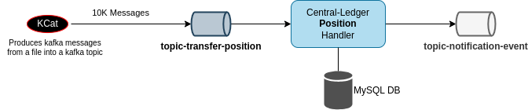
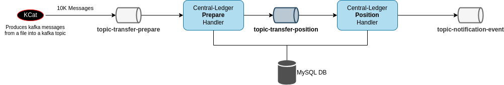

# Profile the Central-Ledger Position Handler in isolation

## Status

| Central Ledger Version |  Date  | Status  | Next  | Notes  |
|---|---|---|---|---|
| 17.0.3 | 2023-08-25 | **The `Position Handler` has achieved a maximum observed maximum throughput of around `163 Op/s` @ `6.37 ms` average duration for `action=prepare` messages and `394 Op/s` @ `3.81 ms` average duration for `action=commit` messages as baseline with the system configuration specified in 'Testing Environment' section.<br><br>**An overview of the observations are summarized as follows:** <br> 1. No considerable issues detected in profiling with Chrome debugger <br>2. No issues detected  with Clinic.js bubbleprof analyser <br>3. If CACHE is disabled, there are `13` queries being executed during processing a `action=prepare` message. And `8` queries during `action=commit` message including BEGIN and COMMITs.<br>3. If CACHE is enabled, there are `9` queries being executed during processing a `action=prepare` message. And `8` queries during `action=commit` message including BEGIN and COMMITs.<br>5. For `5000` messages the total queries for `action=prepare` are `65000` if CACHE is disabled. This matches with the query count in single transfer (i.e. 5000x13)<br>6. If CACHE is enabled, for `5000` messages the total queries for `action=prepare` are reduced to `45000` 🔽<br>7. The indexes are properly set and no slow queries detected<br>8. With the current versions, one position handler can be assigned to each DFSP. And it is hard to scale it further like multiple position handlers for one DFSP. Tested multiple DFSP setup and each position handler could process around `150ops/sec`<br>9. Implemented a PoC version of `PRISMA` concept to pass down the queried data to further handlers to save some query executions but couldn't find any improvement. This is because the queries are already being cached<br><br> **Observed areas that are limiting throughput and scalability:**<br> 1. `Batch processing` implementation is broken and can not be enabled which could improve performance <br> 2. With current setup (kafka key and partition combination), `Scalability` of position handler is not possible for a single DFSP<br><br> _Note: We are not able to determine any single cause of the bottleneck at this time, the load should be handled through batching and scalability._ | See [#follow-up-stores](#follow-up-stories) |   |

## Testing Environment
- Hardware specification and Software versions
  ```
  CPU: AMD Ryzen 9 3900X 12-Core Processor
  Memory: 32GB
  OS: Ubuntu 23.04 linux/amd64
  Docker: v24.0.5
  Mysql: docker:mysql/mysql-server:8.0.32
  Kafka: docker:bitnami/kafka:3.4.0
  Node: v16.15.0
  Central Ledger: v17.0.3
  ```
- Used In-Memory MySQL DB for all the scenarios to rule out disk I/O issues
- Transfers to 2 random DFSPs as payer and payee

## Approach
The approach taken for profiling central ledger in isolation is follows:
- Deployed MySQL and Kafka services as dependencies
- Captured 5000 messages from kafka position topic
- Captured MySQL database state before position handler starts to process the messages
- Replay the MySQL state and kafka messages and observe the running instance of position handler
- Used monitoring services for metrics

Refer to the following diagram showing the interaction diagram:




## Local Setup
- Download [ml-core-test-harness](https://github.com/mojaloop/ml-core-test-harness) repository
- Expose port `9092` of kafka service
- Change `KAFKA_CFG_ADVERTISED_LISTENERS` in kafka environment variables to contain `LISTENER_EXTERN://localhost:9092`
- Start the docker services for dependencies
  ```
  docker compose --project-name ml-core -f docker-compose-perf.yml --profile transfers-test up -d kafka-provisioning kafka mysql-cl
  ```
- Download central-ledger repository
- Add this config to `default.json` -> `KAFKA.CONSUMER.POSITION.config.rdkafkaConf[partition.assignment.strategy]: cooperative-sticky`
- Start **position handler** using the following
  ```
  npm run migrate
  node src/handlers/index.js handler --position
  ```
- Add the new target `<Docker IP of Host>:3001` (ex: 172.17.0.1:3001) to `prometheus.yml`
- Start monitoring services using the following command
  ```
  docker compose --project-name monitoring --profile transfers-test -f docker-compose-monitoring.yml up -d
  ```

## Triggering position messages

- Execute the following script for the messages `action=prepare`
  ```
  sh ./feed-test-data-position-prepare.sh
  ```
- Execute the following script for the messages `action=commit`
  ```
  sh ./feed-test-data-position-commit.sh
  ```
- Now you should see the activity in position handler service
- Observe the grafana dashboard `mojaloop-central-ledger` for **Processed requests per second** and **Processing Time**

## Base Line
### Prepare message handling

Dumped 50k prepare kafka messages on position topic and captured the grafana dashboards `dashboard-images/baseline-prepare`.
A single instance of position handler processed around **163 ops/sec** and the average duration for each message is **6.38ms**

### Commit (i.e. Fulfil) message handling

Dumped 50k commit kafka messages on position topic and captured the grafana dashboards `dashboard-images/baseline-comm,it`.
A single instance of position handler processed around **394 ops/sec** and the max duration for processing message is **8.03ms** and it reduced over the time and minimum duration is **2.47ms**

---

## Profile using chrome debugger
- Run **position handler** using `node --inspect=0.0.0.0:9229 src/handlers/index.js handler --position`
- Use **Chrome Debugger** to connect to this instance and start CPU profiling
- Trigger prepare / commit messages
- Stop profiling and observe the time taken for various operations in the code

### Observations
#### Profile: CPU-20230817T142002.cpuprofile
- The following lines of code seems taking more time in `models/position/facade.js`
  ```
  reservedTransfers[transfer.transferId] = { transferState, transfer, rawMessage, transferAmount }

  processedTransfers[transferId] = { transferState, transfer, rawMessage, transferAmount, runningPosition, runningReservedValue }
  ```
  Initially, I thought if the code is copying any buffer content instead of referencing it but couldn't find any buffer content in the message afterwards.

## Profiling using Clinic.js bubbleprof
- Install **Clinic.js** tool
- Stop the central ledger position handler node service
- Start the service using Clinic.js
  ```
  clinic bubbleprof -- node src/handlers/index.js handler --position
  ```
- Run the **k6** load
- Terminate the position handler and it opens up an html file immediately.
- Sometimes you may see an error `Analysing dataError: premature close`, no need to worry in this case. The profile data is already saved in the current folder `.clinic`. We can generate the html report from the profile dump using the following command.
  ```
  clinic bubbleprof --visualize-only .clinic/<PID>.clinic-bubbleprof
  ```

### Observations
#### Profile: 892321.clinic-bubbleprof.html
- Observed `23,659 ms in asynchronous delays, 19,145 ms in synchronous delays.` in mysql connect calls
  ```
  at Socket.Socket.connect node:net:993:7
  at Connection.connect ../../node_modules/mysql/lib/Connection.js:76:13
  at  ../../node_modules/@mojaloop/central-services-database/node_modules/knex/lib/dialects/mysql/index.js:56:18
  at Client_MySQL.acquireRawConnection ../../node_modules/@mojaloop/central-services-database/node_modules/knex/lib/dialects/mysql/index.js:51:12
  at create ../../node_modules/@mojaloop/central-services-database/node_modules/knex/lib/client.js:237:39
  ```
  By looking at the query log in mysql, the connections are being reused, so it seems like there is no issue.

---

## Mysql queries

The following are the queries executed during a prepare / commit message handling operation.

### Prepare
```
2023-08-21T12:04:15.916493Z        28 Query     select * from `settlementModel` where `isActive` = 1
2023-08-21T12:04:15.918116Z        28 Query     select * from `participant`
2023-08-21T12:04:15.918940Z        28 Query     select * from `participantCurrency` order by `participantCurrencyId` asc
2023-08-21T12:04:15.920707Z        28 Query     BEGIN
2023-08-21T12:04:15.921503Z        28 Query     select * from `transferStateChange` where `transferId` = '9d74acdb-d7da-4362-8f45-661d4fb2c12e' order by `transferStateChangeId` desc limit 1
2023-08-21T12:04:15.922233Z        28 Query     select * from `participantPosition` where `participantCurrencyId` in (7, 8) for update
2023-08-21T12:04:15.922971Z        28 Query     update `participantPosition` set `participantPositionId` = 7, `participantCurrencyId` = 7, `value` = 0, `reservedValue` = '2.0000', `changedDate` = '2023-08-21 12:04:15.921' where `participantPositionId` = 7
2023-08-21T12:04:15.923564Z        41 Query     select * from `participantLimit`
2023-08-21T12:04:15.924732Z        28 Query     update `participantPosition` set `value` = '2.0000', `reservedValue` = '0.0000', `changedDate` = '2023-08-21 12:04:15.921' where `participantPositionId` = 7
2023-08-21T12:04:15.925035Z        28 Query     select * from `transfer` where `transferId` in ('9d74acdb-d7da-4362-8f45-661d4fb2c12e') for update
2023-08-21T12:04:15.926852Z        28 Query     insert into `transferStateChange` (`createdDate`, `reason`, `transferId`, `transferStateChangeId`, `transferStateId`) values ('2023-08-17 15:25:07.000', NULL, '9d74acdb-d7da-4362-8f45-661d4fb2c12e', NULL, 'RESERVED')
2023-08-21T12:04:15.928243Z        28 Query     insert into `participantPositionChange` (`participantPositionId`, `reservedValue`, `transferStateChangeId`, `value`) values (7, '0.0000', 5073, '2.0000')
2023-08-21T12:04:15.928811Z        28 Query     COMMIT
```

### Commit (i.e. Fulfil)
```
2023-08-21T12:07:32.588127Z        28 Query     select `transferParticipant`.*, `tsc`.`transferStateId`, `tsc`.`reason` from `transferParticipant` inner join `transferStateChange` as `tsc` on `tsc`.`transferId` = `transferParticipant`.`transferId` where `transferParticipant`.`transferId` = '8cc5c52d-3b9f-4db3-a848-22c7cb842b10' and `transferParticipant`.`transferParticipantRoleTypeId` = 2 and `transferParticipant`.`ledgerEntryTypeId` = 1 order by `tsc`.`transferStateChangeId` desc limit 1
2023-08-21T12:07:32.589670Z        28 Query     BEGIN
2023-08-21T12:07:32.589984Z        28 Query     select * from `participantPosition` where `participantCurrencyId` = 15 limit 1 for update
2023-08-21T12:07:32.590675Z        28 Query     update `participantPosition` set `value` = '4958.0000', `changedDate` = '2023-08-21 12:07:32.589' where `participantCurrencyId` = 15
2023-08-21T12:07:32.591307Z        28 Query     insert into `transferStateChange` (`createdDate`, `transferId`, `transferStateId`) values ('2023-08-21 12:07:32.589', '8cc5c52d-3b9f-4db3-a848-22c7cb842b10', 'COMMITTED')
2023-08-21T12:07:32.591633Z        28 Query     select * from `transferStateChange` where `transferId` = '8cc5c52d-3b9f-4db3-a848-22c7cb842b10' order by `transferStateChangeId` desc limit 1 for update
2023-08-21T12:07:32.591949Z        28 Query     insert into `participantPositionChange` (`createdDate`, `participantPositionId`, `reservedValue`, `transferStateChangeId`, `value`) values ('2023-08-21 12:07:32.589', 15, 0, 15073, '4958.0000')
2023-08-21T12:07:32.592567Z        28 Query     COMMIT
```

### Observations
- The select statement on `participant` tables uses order by on `name` field. The `explain` command is showing `Using filesort`. Found out that mysql won't use indexes sometimes and it chooses best option available. Tried removing `order by` in the query and there is no difference in the throughput when caching is enabled. There is minor difference when caching is disabled. Anyway we do not need `order by` and we can remove it.
- The select statement on `transfer` table has `for update` which I think locks the row in transfer table which is not necessary although there might not be any other processes try to update the same transfer record.
- The query `select * from `participantPosition` where `participantCurrencyId` in (7, 8) for update` is locking settlement account which might not be required
- Executed 5k position-prepare messages and captured the number of MySQL queries executing during that. These numbers are including `BEGIN` and `COMMIT` statements.
  - CACHE disabled: Observed **65001** queries executed. This tallies with the single message (13queries x 5000).
    The following is the details of the query log with CACHE disabled
    ```
    mysql> select command_type, count(*) from mysql.general_log where event_time between '2023-08-24 09:27:22.252269' and '2023-08-24 09:27:55.514992' group by command_type;
    +--------------+----------+
    | command_type | count(*) |
    +--------------+----------+
    | Query        |    65001 |
    | Connect      |        6 |
    | Quit         |        1 |
    +--------------+----------+
    ```
  - CACHE enabled: Observed **45100** queries executed which is substantial and shows the benefit of caching.
    The following is the output when CACHE enabled
    ```
    mysql> select command_type, count(*) from mysql.general_log where event_time between '2023-08-24 09:48:10.557033' and '2023-08-24 09:48:35.452222' group by command_type;
    +--------------+----------+
    | command_type | count(*) |
    +--------------+----------+
    | Query        |    45100 |
    | Connect      |        3 |
    +--------------+----------+
    2 rows in set (0.51 sec)
    ```
---

## Quick fixes

### Participant order by query - no difference
There is a mysql query being executed to fetch all paricipants using unnecessary order by
`select * from participant order by name asc` in `getAll` function of the file `models/participant/participant.js`
Although that shouldn't be an issue as the index is there on name and if the caching is enabled, tested by disabling the order by and observed `no difference` in throughput with caching enabled. The dahsboards are available at `dashboard-images/participant-orderby-query-prepare` and `dashboard-images/participant-orderby-query-commit`

Prepare: Max 164 ops/sec, Avg duration 6.42ms
Commit: Max 393 ops/sec, Max duration 9.53ms and Min duration 2.49ms

### New kafka snapshot version with syncConcurrency=10, batchSize=10, syncSingleMessage=true, fetch.wait.max.ms: 0, enable.auto.commit: false

The position handler couldn't process messages and observed lot of locks in database. I think the parelllism is not working with position handler.

### Changed info level logs to to debug
Changed all the info level logs in the position handler to debug and observed no difference in throughput. This is expected because the logs are minimal already and doesn't have any large data. The results are captured in `dashboard-images/logs-info-to-debug` and the change is in this branch `feat/reduce-logging` of central-ledger.

### Stage wise execution of 50k transfers using docker perf stack
- Deployed all services and ran provisioning with 8dfsps
- Disabled `position handler`
- Triggered `50k` transfers without waiting for a callback
- Observed the performance of `prepare handler`
  - Each prepare handler processed around `250 ops/sec @ 4.0ms` (Total: 4 instances)
- Disabled Fulfil handler and enabled position handler
- Observed the performance of `postion handler` (action:prepare)
  - Each position handler processed around `150 ops/sec @ 7.68ms` (Total: 5 active instances)
- Enabled fulfil handler and disabled position handler
- Observed the performance of `fulfil handler`
  - Each fulfil handler processed around `280 ops/sec @ 3.5ms` (Total: 4 instances)
- Enabled position handler
- Observed the performance of `position handler` (action: commit)
  - Each position handler processed around `275 ops/sec @ 4.00ms` (Total: 5 active instances)

Results are captured at each stage and are available in folder `dashboard-images/stage-wise-transfer-execution`


### Using new `@mojaloop/central-services-stream` library
Upgraded `@mojaloop/central-services-stream` to **11.1.0** and tested position-prepare and position-commit messages and the throughput is pretty much same. Processed around **164 ops/sec @ 6.41ms** prepare messages and **388 ops/sec @ 4.77ms** commit messages.

The results are captured in the folders `dashboard-images/cl-services-stream-upgrade-prepare` & `dashboard-images/cl-services-stream-upgrade-commit`

### Using new `@mojaloop/central-services-stream` library with `flow mode`
Enabled flow mode. There is no difference in throughput.

The results are captured in the folders `dashboard-images/cl-services-stream-upgrade-prepare-flow-mode` & `dashboard-images/cl-services-stream-upgrade-commit-flow-mode`

### Using new `@mojaloop/central-services-stream` library with `flow mode` with `enable.auto.commit: true` and `syncConcurrency: 2`
Changed the following configuration to enable parallel processing to find out if there is any improvement in performance and also if there are any database locks happening.
```
enable.auto.commit: true
syncConcurrency: 2
```
Observed an increment in the throughput `170 ops/sec @ 12.4ms`. So the duration is also increased by 2x. So it means each thread is waiting for the other thread because of database locks.

And also while processing the commit messages, service crashed and observed very low throughput. Could not capture the results for commit messages.

The results are captured in the folders `dashboard-images/cl-services-stream-upgrade-prepare-flow-mode-sync-concurrency-2`

### Prism approach

Refer to the following diagram showing the interaction diagram:



- Before implementing prism, ran position handler and prepare handler as node services locally and dumped `10k` prepare kafka messages on `topic-transfer-prepare` and captured the readings as base line for this experiment.
- The following are the commands used to run preapre and position handlers as node processes without docker
  ```
  export CLEDG_PORT=3001
  nohup node src/handlers/index.js handler --position 2>&1 > position.log &
  ```

  ```
  export CLEDG_PORT=3002
  nohup node src/handlers/index.js handler --prepare 2>&1 > prepare.log &
  ```
- PRISM implementation can be found in this PR [central-ledger/pull/962](https://github.com/mojaloop/central-ledger/pull/962)
- The following is the comparison with PRISM PoC
  | Scenario | Cache    | Compression       | Prepare Handler   | Position Handler  |
  |----------|----------|-------------------|-------------------|-------------------|
  | Baseline | Disabled | none              | 168 ops/s         | 153 ops/s         |
  | Baseline | Disabled | lz4               | 168 ops/s         | 154 ops/s         |
  | Baseline | Enabled  | none              | 280 ops/s         | 180 ops/s         |
  | Baseline | Enabled  | lz4               | 272 ops/s         | 187 ops/s         |
  | PRISM    | Disabled | none              | 149 ops/s         | 149 ops/s         |
  | PRISM    | Disabled | lz4               | 147 ops/s         | 150 ops/s         |
  | PRISM    | Enabled  | none              | 268 ops/s         | 169 ops/s         |
  | PRISM    | Enabled  | lz4               | 276 ops/s         | 189 ops/s         |

- The system configuration used for testing is as follows:
  - AWS EC2 instance `m6i.4xlarge`
  - `16x` vCPU - `3.5 GHz` 3rd Generation Intel Xeon Scalable processors (Ice Lake 8375C)
  - `64gb` RAM
  - HDD `io2` with `50`-`100` GB, @ `5k`-`25k` iOP/S is used unless otherwise stated (_i.e. 5k iOP/s configured from Scenario 51+ onwards_)
  - Docker Version: 20.10.23
  - Docker Compose version: v2.19.1
  - OS Version: Amazon Linux 2023 

---

## Overall Observations

- **Batch processing**: It seems batch processing implementation is broken in many places. Tried with batch size more than one and got many errors in the log. We should have a story to make batch processing work.
  
  Please refer to this file for the git difference with some fixes, these are not sufficient and I couldn't make it work. This is just for reference.

  [git-diff-batch-processing-fix-attempt.diff](./git-diff-batch-processing-fix-attempt.diff)
- **Parellel processing**: Tried `sync: false` in Kafka consumer configuration, and it didn't work. Got lot of errors in console.log with the existing kafka library and with new snapshot version, got issues with table locks in the database.
- **Scalability**: In the current configuration, we are using a **Destination FSP ID** as key to the kafka message and hence only one position handler need to process all the requests for a DFSP. It is a problem in production scenario, because if a DFSP wants to send high loads, ther is no option interms of scalabilty. We need to look if there are any standary practises to acheive scalability in the fintech world because it looks like a common issue in this space. (Ex: Partitioning DFSP position, Parallelism with row level locking...etc)
- **Issue with Notification Handler**: Found an issue with Notification handler while working on this. When the endpoints of a DFSP are configured with non-exitent dfsp hosts, then the nofication handler is freezing sending the http requests to those hosts and timingout. It's taking more than 15s to timeout and hence the messages are piling up in the kafaka topic.
- The Prepare/Fulfil handlers are not correctly setting the optimised Message Key as the FSPIOP-Destination (DFSP-ID) is currently being used. This may result in unnecessary MySQL row lock contention. We need a follow-up story for this as this should be changed as follows:
    - Prepare should be using the PayerFSP-ID as the Message Key
    - Fulfil should be using the PayeeFSP-ID as the Message Key
    - Abort should be using the PayerFSP-ID as the Message Key
- We can further increase the concurrent processing per DFSP by using the Account-ID instead of the DFSP-ID as the Message Key. <-- we should also create a follow-up story for this
- Also document that the current "batch-process" logic of the position handler (and most likely other handlers, e.g. prepare, fulfil, and even notifications) is failing due to an error/bug that requires further investigation. (ref: https://github.com/mojaloop/project/issues/3488,  https://github.com/mojaloop/project/issues/3489)
- We should also avoid using a hash partition strategy due to the extra partition overhead, and head-ache of partition management based on the key-space to ensure an even distribution. We should instead use a custom consistent partitioner strategy. <-- we should also create a follow-up story for this

## Follow-up stories

_Note: The stories below are not in any order of preference, and will need to be prioritized as required._

| Story | Name | Description | Impact | Issue | Notes |
|---|---|---|---|---|---|
| 1 | Enabling parallel processing of the Position management | Investigate how to enable parallel processing, and also consider sharding Positions to optimism distributed parallel processing. | High | | Does Tiger Beetle do this for us, or even necessary to consider with Tiger Beetle's performance? |
| 2 | Optimize Msg Processing via Batch | Investigate impact of processing messages in batches. | Medium-High | [mojaloop/3488](https://github.com/mojaloop/project/issues/3488) & [mojaloop/3489](https://github.com/mojaloop/project/issues/3489)  | Potential solutions include: optimizing SQL statements due to batching nature. |
| 3 | Reduce Log Verbosity for INFO Log-levels | INFO level logs are too verbose, and should be optimized to provide only a summary of key events/indicators with only key-information (e.g. IDs, Functionality/Event) where required. | Low |   |   |
| 4 | Issue with increasing CACHE duration in Central Ledger  | Transfers fail when the cache is increased in Central-Ledger using CLEDG_CACHE__EXPIRES_IN_MS. This requires further investigation as it may be a due a bug in the underlying cache implementation. | Unknown |   |   |
| 5 | PRISM Approach  | Minimise the number of SQL queries by implementing PRISM to rather pass data between microservices than to re-query that data. | Unknown | [mojaloop/3491](https://github.com/mojaloop/project/issues/3491)  |   |


---

## Appendix

### Capturing Kafka and MySQL dumps for position-prepare
- Download [ml-core-test-harness](https://github.com/mojaloop/ml-core-test-harness) repository
- Expose port `9092` of kafka service
- Change `KAFKA_CFG_ADVERTISED_LISTENERS` in kafka environment variables to contain `LISTENER_EXTERN://localhost:9092`
- Run the services except position handler
```
docker compose --project-name ml-core -f docker-compose-perf.yml --profile transfers-test --profile 2dfsp --profile ttk-provisioning-transfers up -d --scale central-handler-position=0
```
- Wait for the TTK provisioning to be completed
- `Note: We need to start with fresh deployment as we don't want to dump old data`
- Execute k6 load scenario `postTransfersNoCallback` for triggering a fixed number of transfers without waiting for a callback with following command
```
env K6_SCRIPT_CONFIG_FILE_NAME=fspiopTransfersNoCallback.json docker compose --project-name load -f docker-compose-load.yml up
```
- Allow some time to get all messages processed by other handlers
- Dump mysql database `central_ledger` using `mysqldump` command and store it in a file
```
docker exec -it mysql-cl /bin/mysqldump central_ledger > cl-position-handler-testing-prepare.sql
```
- Dump kafka message in the topic `topic-transfer-position` using the following command
```
kcat -b localhost:9092 -t topic-transfer-position > kafka-topic-transfer-position-prepare.dump
```

### Capturing Kafka and MySQL dumps for position-commit
- Now start the position handler and disable fulfil handler
```
docker compose --project-name ml-core -f docker-compose-perf.yml --profile transfers-test --profile 2dfsp up -d --scale ml-handler-notification=1 --scale central-handler-prepare=1 --scale mojaloop-testing-toolkit=0 --scale mojaloop-testing-toolkit-ui=0 --scale central-ledger=1 --scale ml-api-adapter=1 --scale central-handler-position=1 --scale central-handler-fulfil=0
```
- Wait for the fulfil topic is filled with messages
- Disable position handler and enable fulfil handler again
```
docker compose --project-name ml-core -f docker-compose-perf.yml --profile transfers-test --profile 2dfsp up -d --scale ml-handler-notification=1 --scale central-handler-prepare=1 --scale mojaloop-testing-toolkit=0 --scale mojaloop-testing-toolkit-ui=0 --scale central-ledger=1 --scale ml-api-adapter=1 --scale central-handler-position=0 --scale central-handler-fulfil=0
docker compose --project-name ml-core -f docker-compose-perf.yml --profile transfers-test --profile 2dfsp up -d --scale ml-handler-notification=1 --scale central-handler-prepare=1 --scale mojaloop-testing-toolkit=0 --scale mojaloop-testing-toolkit-ui=0 --scale central-ledger=1 --scale ml-api-adapter=1 --scale central-handler-position=0 --scale central-handler-fulfil=1
```
- Wait for the messages to be processed by fulfil handler
- Capture the kafka messages from position topic
```
kcat -b localhost:9092 -t topic-transfer-position > kafka-topic-transfer-position-total.dump
cat kafka-topic-transfer-position-total.dump |grep '"action":"commit"' > kafka-topic-transfer-position-commit.dump
rm kafka-topic-transfer-position-total.dump
```
- Capture mysql database state
```
docker exec -it mysql-cl /bin/mysqldump central_ledger > cl-position-handler-testing-commit.sql
```


### Capturing Kafka and MySQL dumps for prepare messages
- Download [ml-core-test-harness](https://github.com/mojaloop/ml-core-test-harness) repository
- Expose port `9092` of kafka service
- Change `KAFKA_CFG_ADVERTISED_LISTENERS` in kafka environment variables to contain `LISTENER_EXTERN://localhost:9092`
- Run all the services
  ```
  docker compose --project-name ml-core -f docker-compose-perf.yml --profile transfers-test --profile 2dfsp --profile ttk-provisioning-transfers up -d
  ```
- Wait for the TTK provisioning to be completed
- `Note: We need to start with fresh deployment as we don't want to dump old data`
- Disable prepare and position handlers
  ```
  docker compose --project-name ml-core -f docker-compose-perf.yml --profile transfers-test --profile 2dfsp up -d --scale central-handler-position=0 --scale central-handler-prepare=0
  ```
- Execute k6 load scenario `postTransfersNoCallback` for triggering a fixed number of transfers without waiting for a callback with following command
  ```
  env K6_SCRIPT_CONFIG_FILE_NAME=fspiopTransfersNoCallback.json docker compose --project-name load -f docker-compose-load.yml up
  ```
- Allow some time to get all messages processed by other handlers
- Dump mysql database `central_ledger` using `mysqldump` command and store it in a file
  ```
  docker exec -it mysql-cl /bin/mysqldump central_ledger > cl-prepare-handler-testing.sql
  ```
- Dump kafka message in the topic `topic-transfer-prepare` using the following command
  ```
  kcat -b localhost:9092 -t topic-transfer-prepare > kafka-topic-transfer-prepare.dump
  ```

### Testing whole flow with 8DFSPs step by step

- Start all the services with 8DFSPs
```
docker compose --project-name ml-core -f docker-compose-perf.yml --profile transfers-test --profile 8dfsp --profile ttk-provisioning-transfers up -d
```
- Disable position handler
```
docker compose --project-name ml-core -f docker-compose-perf.yml --profile transfers-test --profile 8dfsp up -d --scale central-handler-position=0
```
- Execute k6 load scenario `postTransfersNoCallback` for triggering a fixed number of transfers without waiting for a callback with following command
```
env K6_SCRIPT_CONFIG_FILE_NAME=fspiopTransfersNoCallback.json docker compose --project-name load -f docker-compose-load.yml up
```
- Allow some time to get all messages processed by other handlers
- Disable fulfil handler and enable position handler
```
docker compose --project-name ml-core -f docker-compose-perf.yml --profile transfers-test --profile 8dfsp up -d --scale central-handler-fulfil=0
```
- Enable fulfil handler and disable position handler
```
docker compose --project-name ml-core -f docker-compose-perf.yml --profile transfers-test --profile 8dfsp up -d --scale central-handler-position=0
```
- Enable everything
```
docker compose --project-name ml-core -f docker-compose-perf.yml --profile transfers-test --profile 8dfsp up -d
```
