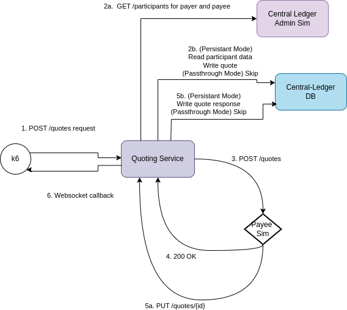

# FSPIOP Agreement Performance Characterization

## Status

| Mojaloop Version |  Date  | Status  | Next  | Notes  |
|---|---|---|---|---|
| 15.1.0* | 2023-10-08 | **The `FSPIOP-Agreement` has achieved a maximum observed End-to-end throughput of around `274 Op/s` @ `51.2 ms` duration based on [Test-Scenario](#scenarios) `#9` results, with the following configuration:**<br> 1. Machine: AWS m6i.4xlarge, 16 CPU 3.5 GHz, 64gb RAM, iO2 SSD 5k-25k iOPS <br> 2. DSPs: 2 <br> 3. Container Scaling: <br> &nbsp;&nbsp;&nbsp;&nbsp;- 3x for Quoting Service <br><br>**An overview of the configuration and code changes made over all [Test-Scenario](#scenarios) are summarized as follows:** <br> 1. Reduced logging to debug and fixed log level checking**Caching** on **Central-Ledger** (ref: [Test-Scenarios](#scenarios) **#1**,**#4**) ~ `7 Op/s` 🔼 <br> | See [#follow-up-stores](#follow-up-stories) |   |

* Test version is based on ML 15.1.0 but metric additions and initial code changes
  were needed before performance testing could be started.
<!--
|   |   |   |   |   |
-->

## Test Cases

Test Case | Description | K6 Test Case | Notes
---------|---------|----------|---------
 1 | FSPIOP Agreement End-to-end | Quotes | FSPIOP POST /quotes request executed from K6 |

## Test Scenarios

### Assumptions

- Use In-Memory DB for all the scenarios to rule out disk I/O issues
- Default is random 2 DFSPs as payer and payee from the configurable pool
- The following AWS machine was used for testing: `m6i.4xlarge`
  - `16x` vCPU - `3.5 GHz` 3rd Generation Intel Xeon Scalable processors (Ice Lake 8375C)
  - `64gb` RAM
  - HDD `io2` with `50`-`100` GB, @ `5k`-`25k` iOP/S is used unless otherwise stated (_i.e. 5k iOP/s configured from Scenario 51+ onwards_)
- Docker Version ([ref](https://gist.github.com/mdebarros/6d9ac90f33c96031cbce6b9a3ea8048e))

  ```bash
  $ docker version
  Client:
  Version:           20.10.23
  API version:       1.41
  Go version:        go1.19.8
  Git commit:        7155243
  Built:             Mon May  1 21:07:11 2023
  OS/Arch:           linux/amd64
  Context:           default
  Experimental:      true

  Server:
  Engine:
    Version:          20.10.23
    API version:      1.41 (minimum version 1.12)
    Go version:       go1.19.8
    Git commit:       6051f14
    Built:            Wed Apr 19 00:00:00 2023
    OS/Arch:          linux/amd64
    Experimental:     false
  containerd:
    Version:          1.6.19
    GitCommit:        1e1ea6e986c6c86565bc33d52e34b81b3e2bc71f
  runc:
    Version:          1.1.7
    GitCommit:        f19387a6bec4944c770f7668ab51c4348d9c2f38
  docker-init:
    Version:          0.19.0
    GitCommit:        de40ad0
  $ docker compose version
  Docker Compose version v2.19.1
  ```

- OS Version

  ```bash
  $ cat /etc/os-release
  NAME="Amazon Linux"
  VERSION="2023"
  ID="amzn"
  ID_LIKE="fedora"
  VERSION_ID="2023"
  PLATFORM_ID="platform:al2023"
  PRETTY_NAME="Amazon Linux 2023"
  ANSI_COLOR="0;33"
  CPE_NAME="cpe:2.3:o:amazon:amazon_linux:2023"
  HOME_URL="https://aws.amazon.com/linux/"
  BUG_REPORT_URL="https://github.com/amazonlinux/amazon-linux-2023"
  SUPPORT_END="2028-03-01"
  ```

### Scenarios

Scenario | Description | Test-Case | Repeatable (Y/N) | K6 Test Scenario / Config | Notes
---------|----------|---------|---------|---------|---------
 1 | FSPIOP Agreement POST /quotes - scale:1, k6vu:1 | 1 | Y | fspiopQuotes | .
 2 | FSPIOP Agreement POST /quotes - scale:1, k6vu:15 | 1 | Y | fspiopQuotes | .
 3 | FSPIOP Agreement POST /quotes - scale:1, k6vu:30 | 1 | Y | fspiopQuotes | .
 4 | FSPIOP Agreement POST /quotes + Logger Fixes - scale:1, k6vu:1 | 1 | Y | fspiopQuotes | .
 5 | FSPIOP Agreement POST /quotes + Logger Fixes - scale:1, k6vu:15 | 1 | Y | fspiopQuotes | .
 6 | FSPIOP Agreement POST /quotes + Logger Fixes - scale:1, k6vu:30 | 1 | Y | fspiopQuotes | .
 7 | FSPIOP Agreement POST /quotes + Logger Fixes - scale:2, k6vu:30 | 1 | Y | fspiopQuotes | .
 8 | FSPIOP Agreement POST /quotes + Logger Fixes - scale:2, k6vu:15 | 1 | Y | fspiopQuotes | .
 9 | FSPIOP Agreement POST /quotes + Logger Fixes - scale:3, k6vu:15 | 1 | Y | fspiopQuotes | .
 10 | FSPIOP Agreement POST /quotes + Logger Fixes + Simple Mode - scale:1, k6vu:15 | 1 | Y | fspiopQuotes | .

<!--
 1 | ... | # | Y/N | . | .
 2 | ... | # | Y/N | . | .
 3 | ... | # | Y/N | . | .
-->

### Approach

The approach taken for characterization is follows:

#### 0. Tools Used

Refer to [../README.md#4-tools-used](../README.md#4-tools-used) for more information.

#### 1. Setup Tests, Test-Scenarios & ml-core-test-harness

Initially setup the ml-core-test-harness to support the [Test Scenarios](#test-scenarios) described above. This is done by setting removing all externalized dependencies by simulating them with a simulator (also known as the "Callback Handler Service").

Refer to the following diagram showing the FSPIOP-Agreement characterization interaction diagram:



#### 2. Capturing End-to-end Metrics

Refer to [../README#capturing-end-to-end-metrics](../README.md#2-capturing-end-to-end-metrics) for more information.

#### 2. Validate Tests, Test-Scenarios & ml-core-test-harness

Once this has been established the next step is to validate the ml-core-test-harness, and the [Test Cases](#test-cases) by executing a [Smoke test](../README.md#3-types-of-tests).

#### 3. Baseline without the Target Service

A baseline without the target service (Quoting service) was skipped since testing using only externalized Simulators was done in fspiop-transfer testing.
Past baselines have shown that the simulators are not a limiting factor/
This is shown in the following diagram, the same diagram as before except with the ML-API-Adapter and Central-Ledger services and handlers being removed:

#### 4. Execute a Tests with the Target Service based on Test Scenarios

This stage we execute the actual Test Scenarios, capture results, and document any observations and findings as a results.

Here we would execute any combination of the following tests based on the [Test Scenarios](#test-scenarios):

1. Average-Load
2. Stress
3. Spike
4. Breakpoint

## Follow-up stories


| Story | Name | Description | Impact | Issue | Notes |
|---|---|---|---|---|---|
| 1 | Re-enable caching on getParticipant and getParticipantEndpoint | Caching for participants and their endpoints should improve quote performance. https://github.com/mojaloop/project/issues/3565 | High | | |
| 2 | Quoting service stalls on large concurrent requests/loads | Quoting service stalls on high concurrency (around 20+ VU), this is an investigation and followup fix https://github.com/mojaloop/project/issues/3564 | High | | |


<!--
|   |   |   |   |   |   |
-->
