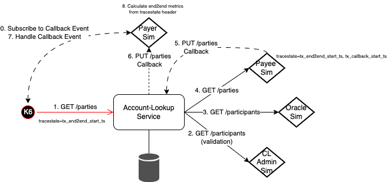
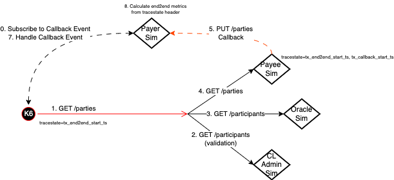

# FSPIOP Discovery Performance Characterization

## Status

| Mojaloop Version |  Date  | Status  | Next  | Notes  |
|---|---|---|---|---|
| 15.1.0 | 2nd Aug 2023 | The `Account-Lookup-Service` (`ALS`) has achieved a significant improvement in throughput (10x), from `10 Op/s` ([ref](./20230726/s2-1690376653994/README.md#observations)) --> `100 Op/s` ([ref](./20230727/s10-1690466917636/README.md#observations)), and reduced duration of from around `100 ms` ([ref](./20230726/s2-1690376653994/README.md#observations)) --> `14 ms` ([ref](./20230727/s10-1690466917636/README.md#observations)) for End-to-end `GET /parties` (inc.Callbacks). These improvements have also shown that the `Account-Lookup-Service` was able to `scale near-linearly` with `4x Instances` achieving just over `400 Op/s` ([ref](./20230728/s16-1690552431770/README.md#observations)) with a duration of `14.9 ms` ([ref](./20230728/s16-1690552431770/README.md#observations)). These impressive results were observed after implementing these pull-requests changes: [account-lookup-service/pull/460](https://github.com/mojaloop/account-lookup-service/pull/460), [account-lookup-service/pull/461](https://github.com/mojaloop/account-lookup-service/pull/461). | See [#follow-up-stores](#follow-up-stories) | `ALS` [v14.2.3](https://github.com/mojaloop/account-lookup-service/releases/tag/v14.2.3) was release to address most of the major performance issues, however the caching improvements have yet to be merged as part of [account-lookup-service/pull/461](https://github.com/mojaloop/account-lookup-service/pull/461) as they require additional effort in design & implementation is required make them "production" grade. |
|   |   |   |   |   |

## Test Cases

Test Case | Description | K6 Test Case | Notes
---------|---------|----------|---------|---------|
 1 | FSPIOP GetParties End-to-end | . | FSPIOP GET /parties request executed from K6 via the Account-Lookup-Service |

## Test Scenarios

Scenario | Description | Test-Case | Repeatable (Y/N) | K6 Test Scenario / Config | Notes
---------|----------|---------|---------|---------|---------
 1 | FSPIOP Discovery GET Parties with Sims-only - ALS:v14.2.2, scale:1, k6vu:1 | 1 | Y |   | .
 2 | FSPIOP Discovery GET Parties with ALS + Sims - ALS:v14.2.2, scale:1, k6vu:1 | 1 | Y |   | .
 3 | ~~FSPIOP Discovery GET Parties with ALS + Sims - ALS:v14.2.2, scale:2, k6vu:1~~ | 1 | Y |   | N/A due to 10 op/s rate limit.
 4 | ~~FSPIOP Discovery GET Parties with ALS + Sims - ALS:v14.2.2, scale:4, k6vu:1~~ | 1 | Y |   | N/A due to 10 op/s rate limit.
 5 | FSPIOP Discovery GET Parties with ALS + Sims + No Logs/Event-Audits - ALS:v14.2.2, scale:1, k6vu:1 | 1 | Y |   | .
 6 | FSPIOP Discovery GET Parties with ALS + Sims + HTTP Keep-Alive - ALS:v14.2.2, scale:1, k6vu:1 | 1 | N |   | .
 7 | FSPIOP Discovery GET Parties with ALS + Sims + UV_THREADPOOL_SCALE scaling - ALS:v14.2.2, scale:1, k6vu:1 | 1 | N |   | .
 8 | FSPIOP Discovery GET Parties with ALS + Sims + K6 VU scaling - ALS:v14.2.2, scale:1, k6vu:1-5 | 1 | N |   | .
 9 | FSPIOP Discovery GET Parties with ALS + Sims + In-Memory MySQL DB - ALS:v14.2.2, scale:1, k6vu:1 | 1 | N |   | .
 10 | FSPIOP Discovery GET Parties with ALS + Sims + JSON.Stringify fix - ALS:v14.2.3, scale:1, k6vu:1 | 1 | N |   | [account-lookup-service/pull/460](https://github.com/mojaloop/account-lookup-service/pull/460), [v14.2.3](https://github.com/mojaloop/account-lookup-service/releases/tag/v14.2.3)
 11 | FSPIOP Discovery GET Parties with ALS + Sims + JSON.Stringify fix - ALS:v14.2.3, scale:1, k6vu:4 | 1 | N |   | .
 12 | FSPIOP Discovery GET Parties with ALS + Sims + JSON.Stringify fix - ALS:v14.2.3, scale:2, k6vu:1 | 1 | N |   | .
 13 | FSPIOP Discovery GET Parties with ALS + Sims + JSON.Stringify fix - ALS:v14.2.3, scale:4, k6vu:4 | 1 | N |   | .
 14 | FSPIOP Discovery GET Parties with ALS + Sims + JSON.Stringify fix - ALS:v14.2.3, scale:4, k6vu:6 | 1 | N |   | .
 15 | FSPIOP Discovery GET Parties with ALS + Sims + JSON.Stringify fix + validateParticipant caching - ALS:v14.2.4-snapshot.3, scale:4, k6vu:6 | 1 | N |   | [account-lookup-service/pull/461](https://github.com/mojaloop/account-lookup-service/pull/461), [v14.2.4-snapshot.3](https://github.com/mojaloop/account-lookup-service/releases/tag/v14.2.4-snapshot.3)
 16 | FSPIOP Discovery GET Parties with ALS + Sims + JSON.Stringify fix + validateParticipant & oracleRequest caching - ALS:v14.3.0-snapshot.0, scale:4, k6vu:6 | 1 | N |   | [account-lookup-service/pull/461](https://github.com/mojaloop/account-lookup-service/pull/461), [v14.3.4-snapshot.0](https://github.com/mojaloop/account-lookup-service/releases/tag/v14.3.0-snapshot.0)
  |   |   |   |   |   |  

### Approach

The approach taken for characterization is follows:

#### 0. Tools Used

Refer to [../README.md#4-tools-used](../README.md#4-tools-used) for more information.

#### 1. Setup Tests, Test-Scenarios & ml-core-test-harness

Initially setup the ml-core-test-harness to support the [Test Scenarios](#test-scenarios) described above. This is done by setting removing all externalized dependencies by simulating them with a simulator (also known as the "Callback Handler Service").

Refer to the following diagram showing the Account-Lookup-Service characterization interaction diagram:

In the above, the "Callback Handler Service" has been used to simulate the following Account-Lookup-Service's dependencies:

- **Oracle** - A Participant (i.e. DFSP) registry that resolves the Participant based on a given Party Identifier (e.g. MSISDN).
- **Payer FSP** - The Payer FSP Participant that will be used to receive the final FSPIOP PUT /parties Callback.
- **Payee FSP** - The Payee FSP Participant that will be used to receive the FSPIOP GET /parties Request, and to generate the FSPIOP PUT /parties Callback response.
- **Central-Ledger Admin Service** - The Central-Ledger Admin Service that provides a GET /participants end-point to validate Participants, and the GET/participants/{participantId}/endpoints to provide the necessary routing information to forward requests for the FSPIOP GET/PUT /parties Request/Callback.

In this stage we would also identify:

1. any metrics that are required to correctly measure and monitoring out tests.
2. any dashboards that are required to visualize that information.

#### 2. Capturing End-to-end Metrics

Refer to [../README#capturing-end-to-end-metrics](../README.md#2-capturing-end-to-end-metrics) for more information.

#### 2. Validate Tests, Test-Scenarios & ml-core-test-harness

Once this has been established the next step is to validate the ml-core-test-harness, and the [Test Cases](#test-cases) by executing a [Smoke test](../README.md#3-types-of-tests).

#### 3. Baseline without the Target Service

Once this the [Smoke test](#types-of-tests) is successful, we will then perform a [Stress test](#types-of-tests) by-passing the service (The Account-lookup-Service in this example) we wish to characterize and instead directly hit all externalized Simulators (i.e. "Callback Handler Service").

This is shown in the following diagram, the same diagram as before except with the Account-Lookup-Service being removed:

The main advantage of this step is that we are able to determine the theoretical limits of what the Simulators are capable off, and most importantly what they are capable of in the configured typology (i.e. the underlying infrastructure, the number of simulators, etc). This will give us a good indication of when we are being limited by the Simulators when testing against our target Service (e.g. Account-Lookup-Service).

This baseline is general defined to as [Test Scenarios](#test-scenarios) 1.

#### 4. Execute a Tests with the Target Service based on Test Scenarios

This stage we execute the actual Test Scenarios, capture results, and document any observations and findings as a results.

Here we would execute any combination of the following tests based on the [Test Scenarios](#test-scenarios):

1. Average-Load
2. Stress
3. Spike
4. Breakpoint

## Follow-up stories

| Story | Name | Description | Impact | Issue | Notes |
|---|---|---|---|---|---|
| 1 | **Optimize DFSP Validations** | Add caching to Validation calls for PayerFSP and PayeeFSP on both FSPIOP GET /participant and PUT /participant, or alternatively consider adding a new API operation that is more optimized (i.e. a 2. single API call to validate both PayerFSP & PayeeFSP). | High | [mojaloop/#3426](https://github.com/mojaloop/project/issues/3426)  |   |
| 2 | **Optimize Oracle Resolution** | We can further improve performance by caching requests for the both the internal Oracle resolution, and the actual Oracle GET /participants request | Medium-High | [mojaloop/#3427](https://github.com/mojaloop/project/issues/3427)  |   |
| 3 | **Profile NodeJS Process on ALS** | Some initial work has been done here which has already provided some huge performance gains, but there is certainly more gains to be achieved here. | Medium-High | [mojaloop/#3429](https://github.com/mojaloop/project/issues/3429)  |   |
| 4 | **HTTP Keep-alive support** | Provide configuration to HTTP Agent as part of ALS config (i.e. default.json) that can be overridden. | Medium | [mojaloop/#3428](https://github.com/mojaloop/project/issues/3428).  |   |
| 5 | **Instrument End-to-end metrics ALS using trace headers** | Implement similar approach implemented in the Transfer processing flow to capture the End-to-end metrics as part of ALS instrumentation. | N/A (Improved Instrumentation) | [mojaloop/#3431](https://github.com/mojaloop/project/issues/3431). | Refs: [1](https://github.com/mojaloop/ml-api-adapter/blob/master/src/api/transfers/handler.js#L61), [2](https://github.com/mojaloop/ml-api-adapter/blob/982f164da0e91ea19277a47444456aecb1102d24/src/api/transfers/handler.js#L103), [3](https://github.com/mojaloop/ml-api-adapter/blob/982f164da0e91ea19277a47444456aecb1102d24/src/handlers/notification/index.js#L48), [4](https://github.com/mojaloop/ml-api-adapter/blob/982f164da0e91ea19277a47444456aecb1102d24/src/handlers/notification/index.js#L179) |
| 6 | **Re-run Test Scenarios 5-7 with the 400 Op/s** | Test Scenarios 5-7 should be re-run since we are no longer limited to the `10 Op/s`, and are now able to achieve `100 Op/s` to understand if there is any major impact with the increased throughput. | To Be Confirmed |   |
| 7 | **Perf Characterize GET /Participants** | The `GET /participants` should be characterized similiarly to the `GET parties` characterization effort, as it was not been included in the initial characterization effort as the `GET /parties` was identified as the critical path. | To Be Confirmed |   |
| 8 | **Perf Characterize Error Scenarios** | Error scenarios such as `PUT /Participants/{id}/error` and `PUT /parties/{id}/error` have not been included in the initial characterization effort. Error Scenarios should be characterized in both isolation and in-combination with both Happy and Error Scenarios. | To Be Confirmed |   |
|   |   |   |   |   |
