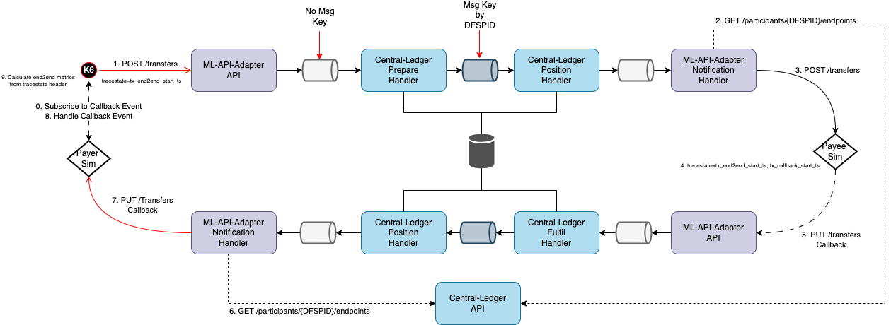
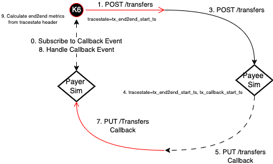

# FSPIOP Transfers Performance Characterization

## Status

| Mojaloop Version |  Date  | Status  | Next  | Notes  |
|---|---|---|---|---|
| 15.1.0 | 2023-08-11 | **The `FSPIOP-Transfers` has achieved a maximum observed End-to-end throughput of around `220 Op/s` @ `140 ms` duration based on [Test-Scenario](#scenarios) `#46` results, with the following configuration:**  1. Machine: AWS m6i.4xlarge, 16 CPU 3.5 GHz, 64gb RAM   2. DSPs: 8   3. Container Scaling:   &nbsp;&nbsp;&nbsp;&nbsp;- 4x for All Services/Handlers in general,  &nbsp;&nbsp;&nbsp;&nbsp;- 8x Position Handlers being the exception.   **An overview of the configuration and code changes that have been made are summarized as follows:**   1. Enabled **Caching** on **Central-Ledger** (ref: [Test-Scenarios](#scenarios) **#29**,**#30**) ~ `7 Op/s` 🔼  2. Released **ML-API-Adapter** [v14.0.1-snapshot.2](https://github.com/mojaloop/ml-api-adapter/releases/tag/v14.0.1-snapshot.2) with minor **JSON.stringify optimizations** (ref: [Test-Scenario](#scenarios) **#41**) ~ ◀️  3. **Logging** & **Audit-Events** `On` vs `Off` (ref: [Test-Scenario](#scenarios) **#38**, **#39**) ~ `15 Op/s` 🔼   4. Disabling **Payee Notification** (ref: [Test-Scenario](#scenarios) **#34**) ~ ◀️   5. Local **MySQL** Optimization (ref: [Test-Scenario](#scenarios) **#44**,**#45**) ~ `3 Op/s` 🔼   6. **Managed MySQL** (ref: [Test-Scenario](#scenarios) **#48**) ~ ◀️   7. Optimized Kafka **Partitioning Assignment Strategy** (ref: [Test-Scenario](#scenarios) **#51**) ~ ◀️   8. Optimized Kafka **Partitioning sizing** (ref: [Test-Scenario](#scenarios) **#53**) ~ ◀️    **Observed areas that are limiting throughput and scalability:**  1. High MySQL IO due to un-optimized operations   2. ML-API-Adapter Notification Handler is showing a high NodeJS Event Loop Lag, yet to be determined by detailed profiling  3. Central-Ledger Handlers (especially Positions) are showing a moderate NodeJS Event Loop Lag, yet to be determined by detailed profiling   4. Shared resource constraints of a single machine | See [#follow-up-stores](#follow-up-stories) |   |
|   |   |   |   |   |

## Test Cases

Test Case | Description | K6 Test Case | Notes
---------|---------|----------|---------
 1 | FSPIOP Transfers End-to-end | Transfers | FSPIOP POST /transfers request executed from K6 |

## Test Scenarios

### Assumptions

- Use In-Memory DB for all the scenarios to rule out disk I/O issues
- Disable cl-timeout handler
- Disable cl-get handler
- Default is random 2 DFSPs as payer and payee from the configurable pool
- No PATCH CALLBACKS and ~~No PAYEE NOTIFICATION~~ (Env Var: `MLAPI_TRANSFERS__SEND_TRANSFER_CONFIRMATION_TO_PAYEE=false`, _Note: This was incorrectly configured until [Test-Scenario](#scenarios) **#34**_)

### Scenarios

Scenario | Description | Test-Case | Repeatable (Y/N) | K6 Test Scenario / Config | Notes
---------|----------|---------|---------|---------|---------
 1 | FSPIOP Transfers POST /transfers with Sims-only + Unidirectional - scale:1, k6vu:1 | 1 | Y | fspiopTransfers | .
 2 | FSPIOP Transfers POST /transfers with Sims-only + Unidirectional - scale:1, k6vu:MAX | 1 | Y | fspiopTransfers | .
 3 | FSPIOP Transfers POST /transfers with MLAPI & CL - scale:1, k6vu:1 | 1 | Y | fspiopTransfers | .
 4 | FSPIOP Transfers POST /transfers with MLAPI & CL - scale:1, k6vu:MAX | 1 | Y | fspiopTransfers | .
 5 | ~~FSPIOP Transfers POST /transfers with MLAPI & CL - scale:2, k6vu:1~~ | 1 | Y | fspiopTransfers | .
 6 | FSPIOP Transfers POST /transfers with MLAPI & CL - scale:2, k6vu:MAX | 1 | Y | fspiopTransfers | .
 7 | ~~FSPIOP Transfers POST /transfers with MLAPI & CL + Unidirectional - scale:2, k6vu:1~~ | 1 | Y | fspiopTransfers | .
 8 | FSPIOP Transfers POST /transfers with MLAPI & CL + Unidirectional - scale:2, k6vu:MAX | 1 | Y | fspiopTransfers | .
 9 | ~~FSPIOP Transfers POST /transfers with MLAPI & CL - scale:2, k6vu:1, dfsps:4 | 1 | Y | fspiopTransfers~~ | .
 10 | FSPIOP Transfers POST /transfers with MLAPI & CL - scale:2, k6vu:MAX, dfsps:4 | 1 | Y | fspiopTransfers | .
 11 | FSPIOP Transfers POST /transfers with MLAPI & CL - scale:2, k6vu:MAX, dfsps:8 | 1 | Y | fspiopTransfers | .
 12 | FSPIOP Transfers POST /transfers with MLAPI & CL with cache config enabled - scale:1, k6vu:1 | 1 | Y | fspiopTransfers | .
 13 | FSPIOP Transfers POST /transfers with MLAPI & CL with cache config enabled - scale:1, k6vu:MAX | 1 | Y | fspiopTransfers | .
 14 | ~~FSPIOP Transfers POST /transfers with MLAPI & CL with mocked central-admin-api - scale:1, k6vu:1~~ | 1 | Y | fspiopTransfers | .
 15 | ~~FSPIOP Transfers POST /transfers with MLAPI & CL with mocked central-admin-api - scale:2, k6vu:MAX~~ | 1 | Y | fspiopTransfers | .
 16 | ~~FSPIOP Transfers POST /transfers with MLAPI & CL with mocked central-admin-api + No Logs/Event-Audits - scale:1, k6vu:MAX~~ | 1 | Y | fspiopTransfers | .
 17 | ~~FSPIOP Transfers POST /transfers with MLAPI & CL with mocked central-admin-api + UV_THREADPOOL_SCALE:24 - scale:1, k6vu:MAX~~ | 1 | Y | fspiopTransfers | .
 18 | ~~FSPIOP Transfers POST /transfers with MLAPI & CL with mocked central-admin-api + No Logs/Event-Audits + UV_THREADPOOL_SCALE:24 - scale:1, k6vu:MAX~~ | 1 | Y | fspiopTransfers | .
 19 | ~~FSPIOP Transfers POST /transfers with MLAPI & CL with mocked central-admin-api + No Logs/Event-Audits + UV_THREADPOOL_SCALE:24 - scale:1, k6vu:MAX~~ | 1 | Y | fspiopTransfers | .
 20 | FSPIOP Transfers POST /transfers with MLAPI & CL + Timeout handler - scale:1, k6vu:1 | 1 | Y | fspiopTransfers | .
 21 | FSPIOP Transfers POST /transfers with MLAPI & CL + Timeout handler - scale:1, k6vu:MAX | 1 | Y | fspiopTransfers | .
 22 | FSPIOP Transfers POST /transfers with MLAPI & CL + Timeout handler - scale:2-4, k6vu:1 | 1 | Y | fspiopTransfers | .
 23 | FSPIOP Transfers POST /transfers with MLAPI & CL + Timeout handler - scale:2-4, k6vu:MAX | 1 | Y | fspiopTransfers | .
 24 | FSPIOP Transfers POST /transfers with MLAPI & CL + PAYEE NOTIFICATION - scale:2, k6vu:MAX | 1 | Y | fspiopTransfers | .
 25 | FSPIOP Transfers POST /transfers with MLAPI & CL - scale:2+4position+4notification, k6vu:MAX, dfsps:8, partitions: 17  | 1 | Y | fspiopTransfers | .
 26 | FSPIOP Transfers POST /transfers with MLAPI & CL - scale:2+8position+4notification, k6vu:MAX, dfsps:8, partitions: 17  | 1 | Y | fspiopTransfers | .
 27 | FSPIOP Transfers POST /transfers with MLAPI & CL - scale:2+4position+4notification, k6vu:MAX, dfsps:4, partitions: 17, diskSize:100gb | 1 | Y | fspiopTransfers | .
 28 | FSPIOP Transfers POST /transfers with MLAPI & CL - scale:2+4position+4notification, k6vu:MAX, dfsps:8, partitions: 17, diskSize:100gb | 1 | Y | fspiopTransfers | .
 29 | **FSPIOP Transfers POST /transfers with MLAPI & CL - scale:4+8position+4notification, k6vu:16, dfsps:8, partitions: 17,  diskSize:100gb** | 1 | Y | fspiopTransfers | .
 30 | **FSPIOP Transfers POST /transfers with MLAPI & CL + Cache - scale:2, dfsps:8, partitions: 17, k6vu:MAX** | 1 | Y | fspiopTransfers | .
 31 | FSPIOP Transfers POST /transfers with MLAPI & CL + Cache - scale:2+8position+4notification, dfsps:8, partitions: 17, k6vu:12 | 1 | Y | fspiopTransfers | .
 32 | FSPIOP Transfers POST /transfers with MLAPI & CL + Cache - scale:4+8position+4notification, dfsps:4, partitions: 17, k6vu:16 | 1 | Y | fspiopTransfers | .
 33 | FSPIOP Transfers POST /transfers with MLAPI & CL + Cache - scale:4+8position+4notification, dfsps:8, partitions: 17, k6vu:16 | 1 | Y | fspiopTransfers | .
 34 | **FSPIOP Transfers POST /transfers with MLAPI & CL + Cache + extra notification switched off env var - scale:2+8position+4notification, dfsps:8, partitions: 17, k6vu:16** | 1 | Y | fspiopTransfers
 35 | FSPIOP Transfers POST /transfers with MLAPI & CL + Cache + extra notification switched off - scale:2+8position+4notification, dfsps:8, partitions: 17, k6vu:16| 1 | Y | fspiopTransfers
 36 | FSPIOP Transfers POST /transfers with MLAPI & CL + Cache + extra notification switched off + logging off - scale:2+8position+4notification, dfsps:8, partitions: 17, k6vu:16| 1 | Y | fspiopTransfers
 37 | FSPIOP Transfers POST /transfers with MLAPI & CL + Cache + extra notification switched off + logging off + audit logs off - scale:2+8position+4notification, dfsps:8, partitions: 17, k6vu:16 | 1 | Y | fspiopTransfers
 38 | **FSPIOP Transfers POST /transfers with MLAPI & CL + Cache + extra notification switched off + logging off + audit logs off + UV_THREADPOOL_SCALE:24 - scale:2+8position+4notification, dfsps:8, partitions: 17, k6vu:16** | 1 | Y | fspiopTransfers
 39 | **FSPIOP Transfers POST /transfers with MLAPI & CL + Cache + extra notification switched off + logging on + audit logs on + UV_THREADPOOL_SCALE:24 - scale:2+8position+4notification, dfsps:8, partitions: 17, k6vu:16** | 1 | Y | fspiopTransfers
 40 | FSPIOP Transfers POST /transfers with MLAPI & CL + Cache + extra notification switched off + logging on + audit logs on + UV_THREADPOOL_SCALE:24 - scale:2+8position+4notification, dfsps:8, partitions: 17, k6vu:20 | 1 | Y | fspiopTransfers
 41 | **FSPIOP Transfers POST /transfers with MLAPI & CL + Cache + extra notification switched off + logging on + audit logs on + UV_THREADPOOL_SCALE:24 + ML notification stringify fix - scale:2+8position+4notification, dfsps:8, partitions: 17, k6vu:20** | 1 | Y | fspiopTransfers
 42 | FSPIOP Transfers POST /transfers with MLAPI & CL + Cache + extra notification switched off + logging on + audit logs on + UV_THREADPOOL_SCALE:24 + ML notification stringify fix - scale:2+8position+4notification, dfsps:8, partitions: 17, k6vu:30 | 1 | Y | fspiopTransfers
 43 | FSPIOP Transfers POST /transfers with MLAPI & CL + Cache + extra notification switched off + logging on + audit logs on + UV_THREADPOOL_SCALE:24 + ML notification stringify fix + mocked central admin api - scale:2+8position+4notification, dfsps:8, partitions: 17, k6vu:30 | 1 | Y | fspiopTransfers
 44 | **FSPIOP Transfers POST /transfers with MLAPI & CL + Cache + extra notification switched off + logging on + audit logs on + UV_THREADPOOL_SCALE:24 + ML notification stringify fix + reduced IOPS - scale:2+8position+4notification, dfsps:8, partitions: 17, k6vu:20** | 1 | Y | fspiopTransfers
 45 | **FSPIOP Transfers POST /transfers with MLAPI & CL + Cache + extra notification switched off + logging on + audit logs on + UV_THREADPOOL_SCALE:24 + ML notification stringify fix + reduced IOPS + bin_log off - scale:2+8position+4notification, dfsps:8, partitions: 17, k6vu:20** | 1 | Y | fspiopTransfers
 46 | **FSPIOP Transfers POST /transfers with MLAPI & CL + Cache + extra notification switched off + logging on + audit logs on + UV_THREADPOOL_SCALE:24 + ML notification stringify fix + reduced IOPS + bin_log off - scale:4+8position+4notification, dfsps:8, partitions: 17, k6vu:30** | 1 | Y | fspiopTransfers
 47 | **FSPIOP Transfers POST /transfers with MLAPI & CL + Cache + extra notification switched off + logging on + audit logs on + UV_THREADPOOL_SCALE:24 + ML notification stringify fix + reduced IOPS + managed mysql - scale:4+8position+4notification, dfsps:8, partitions: 17, k6vu:30** | 1 | Y | fspiopTransfers
 48 | FSPIOP Transfers POST /transfers with MLAPI & CL + Cache + extra notification switched off + logging on + audit logs on + UV_THREADPOOL_SCALE:24 + ML notification stringify fix + reduced IOPS + managed mysql - scale:6+8position+4notification, dfsps:8, partitions: 17, k6vu:30 | 1 | Y | fspiopTransfers
 51 | **FSPIOP Transfers POST /transfers with MLAPI & CL + Cache + extra notification switched off + logging on + audit logs on + UV_THREADPOOL_SCALE:24 + ML notification stringify fix + reduced IOPS + bin_log off + kafka partition.assignment.strategy=cooperative-sticky - scale:4+8position+4notification, dfsps:8, partitions: 17, k6vu:20** | 1 | Y | fspiopTransfers
 53 | **FSPIOP Transfers POST /transfers with MLAPI & CL + Cache + extra notification switched off + logging on + audit logs on + UV_THREADPOOL_SCALE:24 + ML notification stringify fix + reduced IOPS + bin_log off + kafka partition.assignment.strategy=cooperative-sticky - scale:4+8position+4notification, dfsps:8, partitions: 19, k6vu:20** | 1 | Y | fspiopTransfers

<!--
 1 | ... | # | Y/N | . | .
 2 | ... | # | Y/N | . | .
 3 | ... | # | Y/N | . | .
-->

### Approach

The approach taken for characterization is follows:

#### 0. Tools Used

Refer to [../README.md#4-tools-used](../README.md#4-tools-used) for more information.

#### 1. Setup Tests, Test-Scenarios & ml-core-test-harness

Initially setup the ml-core-test-harness to support the [Test Scenarios](#test-scenarios) described above. This is done by setting removing all externalized dependencies by simulating them with a simulator (also known as the "Callback Handler Service").

Refer to the following diagram showing the FSPIOP-Transfers characterization interaction diagram:

#### 2. Capturing End-to-end Metrics

Refer to [../README#capturing-end-to-end-metrics](../README.md#2-capturing-end-to-end-metrics) for more information.

#### 2. Validate Tests, Test-Scenarios & ml-core-test-harness

Once this has been established the next step is to validate the ml-core-test-harness, and the [Test Cases](#test-cases) by executing a [Smoke test](../README.md#3-types-of-tests).

#### 3. Baseline without the Target Service

Once this the [Smoke test](../README.md#3-types-of-tests) is successful, we will then perform a [Stress test](../README.md#3-types-of-tests) by-passing the service (The ML-API-Adapter and Central-Ledger components in this example) we wish to characterize and instead directly hit all externalized Simulators (i.e. "Callback Handler Service").

This is shown in the following diagram, the same diagram as before except with the ML-API-Adapter and Central-Ledger services and handlers being removed:

The main advantage of this step is that we are able to determine the theoretical limits of what the Simulators are capable off, and most importantly what they are capable of in the configured typology (i.e. the underlying infrastructure, the number of simulators, etc). This will give us a good indication of when we are being limited by the Simulators when testing against our target Service (e.g. Account-Lookup-Service).

This baseline is general defined to as [Test Scenarios](#test-scenarios) #1.

#### 4. Execute a Tests with the Target Service based on Test Scenarios

This stage we execute the actual Test Scenarios, capture results, and document any observations and findings as a results.

Here we would execute any combination of the following tests based on the [Test Scenarios](#test-scenarios):

1. Average-Load
2. Stress
3. Spike
4. Breakpoint

## Follow-up stories

| Story | Name | Description | Impact | Issue | Notes |
|---|---|---|---|---|---|
| 1 | Enabling parallel processing of the Position management | Investigate how to enable parallel processing, and also consider sharding Positions to optimism distributed parallel processing. | High | | Does Tiger Beetle do this for us, or even necessary to consider with Tiger Beetle's performance? |
| 2 | Optimize MySQL IO | Central-Ledger indicates that we are heavily bound by MySQL IO, investigating potential solutions to reduce this dependency would drastically improve performance. | High | | Potential solutions include: PRISM (propagate data in messages), Simplify & Merge SQL statements, Cache SQL Queries, use In-memory processing for position-management, etc |
| 3 | Optimize Central-Service-Stream Lib | Investigate how to optimize Kafka Streaming lib, and add [metrics instrumentation](https://github.com/Collaborne/node-rdkafka-prometheus). | Medium-High |   | Potential solutions include: serialization using Protobuf, and monitor local msg queue vs kafka queue to determine if lag is by the NodeJS vs Node-Rdkafka process |
| 4 | Optimize Msg Processing via Batch | Investigate impact of processing messages in batches. | Medium-High |   | Potential solutions include: optimizing SQL statements due to batching nature. |
| 5 | Profile Position Handler in isolation | Profile Central-Ledger Position Handler as its one of the components showing the usage of resources (i.e CPU). | Medium-High |   |   |
| 6 | Profile Notification Handler in isolation | Profile ML-API-Adapter Notification Handler as its one of the components showing the usage of resources (i.e CPU). | Medium-High |   |   |
| 7 | Apply JSON.stringify fix to ML-API-Adapter Notification Handler | ML-API-Adapter Notification Handler is calling JSON.stringify unnecessary for each Kafka message consumed, however the impact of this change tested via a snapshot releases was minimal which is probably due to "other limiting" factors. We expect that this would certainly be a "high" impact issue if we are able to resolve the "other limiting" factors. | Medium |   | [ml-api-adapter/pull/510](https://github.com/mojaloop/ml-api-adapter/pull/510), [v14.0.1-snapshot.2](https://github.com/mojaloop/ml-api-adapter/releases/tag/v14.0.1-snapshot.2) |
| 8 | Apply JSON.stringify fix to Central-Ledger Admin API | Central-Ledger Admin API has the same JSON.stringify for all sync responses, however most interactions with the API is cached by the ALS and ML-API adapter making the impact minimal. | Low |   | [central-ledger/pull/961](https://github.com/mojaloop/central-ledger/pull/961) |
| 9 | Benchmark caching libraries (i.e. Catbox vs Node-Cache).  | Benchmark performance of the caching libraries (i.e. Catbox vs Node-Cache) to determine if the performance difference is impactful enough to refactor caching implementation with Node-Cache. | Low-Medium |   |   |
| 10 | Reduce Log Verbosity for INFO Log-levels | INFO level logs are too verbose, and should be optimized to provide only a summary of key events/indicators with only key-information (e.g. IDs, Functionality/Event) where required. | Low |   |   |
| 11 | Performance Characterize FPSIOP-Transfers using Managed Kafka instance | Performance Characterize FPSIOP-Transfers against a Managed Kafka instance to determine if the impact of an optimized Kafaka deployment. | Unknown |   |   |
|   |   |   |   |   |   |
| 12 | Issue with increasing CACHE duration in Central Ledger  | When the cache is increased in central ledger using CLEDG_CACHE__EXPIRES_IN_MS, transfers are not going through. It seems like a bug, but need to investigate it more. | Unknown |   |   |
|   |   |   |   |   |   |
