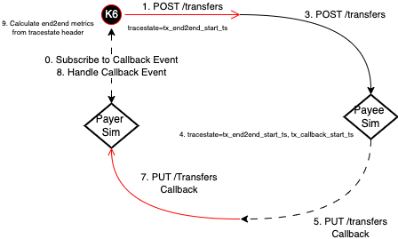

# FSPIOP Transfers Performance Characterization

## Status

| Mojaloop Version |  Date  | Status  | Next  | Notes  |
|---|---|---|---|---|
| 15.1.0 | 2023-08-24 |  | See [#follow-up-stores](#follow-up-stories) |   |

<!--
|   |   |   |   |   |
-->

## Test Cases

Test Case | Description | K6 Test Case | Notes
---------|---------|----------|---------
 1 | Producer - Test script to test producing Kafka messages based on a time, or number of iterations. | N/A | FSPIOP POST /transfers request executed from K6 |
 2 | Consumer - Test script to test consume Kafka messages based on a time, or number of iterations. | N/A | FSPIOP POST /transfers request executed from K6 |

## Test Scenarios

### Assumptions

- The following AWS machine was used for testing: `m6i.4xlarge`
  - `16x` vCPU - `3.5 GHz` 3rd Generation Intel Xeon Scalable processors (Ice Lake 8375C)
  - `64gb` RAM
  - HDD `io2` with `50`-`100` GB, @ `5k`-`25k` iOP/S is used unless otherwise stated (_i.e. 5k iOP/s configured from Scenario 51+ onwards_)
- Docker Version ([ref](https://gist.github.com/mdebarros/6d9ac90f33c96031cbce6b9a3ea8048e))

  ```bash
  $ docker version
  Client:
  Version:           20.10.23
  API version:       1.41
  Go version:        go1.19.8
  Git commit:        7155243
  Built:             Mon May  1 21:07:11 2023
  OS/Arch:           linux/amd64
  Context:           default
  Experimental:      true

  Server:
  Engine:
    Version:          20.10.23
    API version:      1.41 (minimum version 1.12)
    Go version:       go1.19.8
    Git commit:       6051f14
    Built:            Wed Apr 19 00:00:00 2023
    OS/Arch:          linux/amd64
    Experimental:     false
  containerd:
    Version:          1.6.19
    GitCommit:        1e1ea6e986c6c86565bc33d52e34b81b3e2bc71f
  runc:
    Version:          1.1.7
    GitCommit:        f19387a6bec4944c770f7668ab51c4348d9c2f38
  docker-init:
    Version:          0.19.0
    GitCommit:        de40ad0
  $ docker compose version
  Docker Compose version v2.19.1
  ```

- OS Version

  ```bash
  $ cat /etc/os-release
  NAME="Amazon Linux"
  VERSION="2023"
  ID="amzn"
  ID_LIKE="fedora"
  VERSION_ID="2023"
  PLATFORM_ID="platform:al2023"
  PRETTY_NAME="Amazon Linux 2023"
  ANSI_COLOR="0;33"
  CPE_NAME="cpe:2.3:o:amazon:amazon_linux:2023"
  HOME_URL="https://aws.amazon.com/linux/"
  BUG_REPORT_URL="https://github.com/amazonlinux/amazon-linux-2023"
  SUPPORT_END="2028-03-01"
  ```

### Scenarios

Scenario | Description | Test-Case | Repeatable (Y/N) | K6 Test Scenario / Config | Notes
---------|----------|---------|---------|---------|---------
 1 | ... | # | Y/N | . | .

<!--
 1 | ... | # | Y/N | . | .
 2 | ... | # | Y/N | . | .
 3 | ... | # | Y/N | . | .
-->

### Approach

The approach taken for characterization is follows:

#### 0. Tools Used

TODO!

#### 1. Setup Tests, Test-Scenarios & ml-core-test-harness

Initially setup the ml-core-test-harness to support the [Test Scenarios](#test-scenarios) described above. This is done by setting removing all externalized dependencies by simulating them with a simulator (also known as the "Callback Handler Service").

Refer to the following diagram showing the FSPIOP-Transfers characterization interaction diagram:


#### 2. Capturing End-to-end Metrics

Refer to [../README#capturing-end-to-end-metrics](../README.md#2-capturing-end-to-end-metrics) for more information.

#### 2. Validate Tests, Test-Scenarios & ml-core-test-harness

Once this has been established the next step is to validate the ml-core-test-harness, and the [Test Cases](#test-cases) by executing a [Smoke test](../README.md#3-types-of-tests).

#### 3. Baseline without the Target Service

Once this the [Smoke test](../README.md#3-types-of-tests) is successful, we will then perform a [Stress test](../README.md#3-types-of-tests) by-passing the service (The ML-API-Adapter and Central-Ledger components in this example) we wish to characterize and instead directly hit all externalized Simulators (i.e. "Callback Handler Service").

This is shown in the following diagram, the same diagram as before except with the ML-API-Adapter and Central-Ledger services and handlers being removed:



The main advantage of this step is that we are able to determine the theoretical limits of what the Simulators are capable off, and most importantly what they are capable of in the configured typology (i.e. the underlying infrastructure, the number of simulators, etc). This will give us a good indication of when we are being limited by the Simulators when testing against our target Service (e.g. Account-Lookup-Service).

This baseline is general defined to as [Test Scenarios](#test-scenarios) #1.

#### 4. Execute a Tests with the Target Service based on Test Scenarios

This stage we execute the actual Test Scenarios, capture results, and document any observations and findings as a results.

Here we would execute any combination of the following tests based on the [Test Scenarios](#test-scenarios):

1. Average-Load
2. Stress
3. Spike
4. Breakpoint

## Follow-up stories

_Note: The stories below are not in any order of preference, and will need to be prioritized as required._

| Story | Name | Description | Impact | Issue | Notes |
|---|---|---|---|---|---|
|   |   |   |   |   |   |

<!--
|   |   |   |   |   |   |
-->
