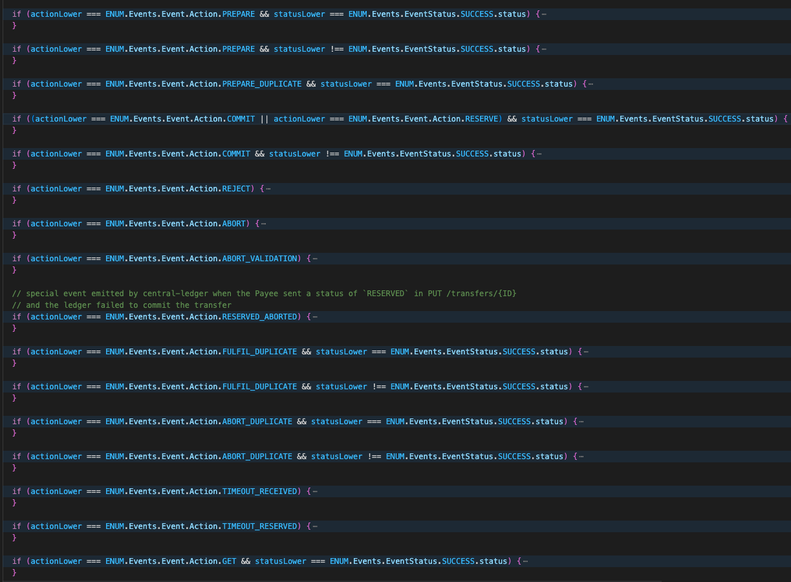

Below are the differences/suggestions that were identified as part of comparing the code against sequence diagrams.

### Location of Sequence Diagram: 
[1.1.4.a-send-notification-to-participant-v1.1.html](https://docs.mojaloop.io/technical/central-ledger/transfers/1.1.4.a-send-notification-to-participant-v1.1.html)

### Source Code: 
[src/handlers/notification/index.js](https://github.com/mojaloop/ml-api-adapter/blob/master/src/handlers/notification/index.js)

 - At lines 267, 291, 300, 308 logic is not consistent. Metrics information capture is missing in some loops
 - Lines 295, 304, 323 what if the call is unsuccessful
 - Not all the scenarios are covered as part of the sequence diagrams
 
 - For failure scenarios, not sure if the relevant error codes are being returned.
